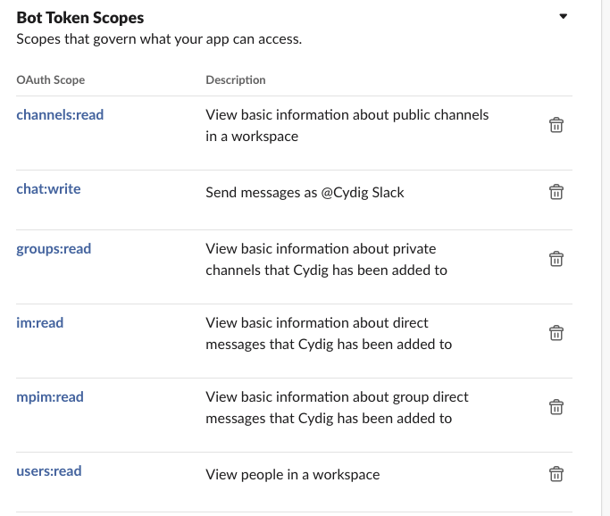
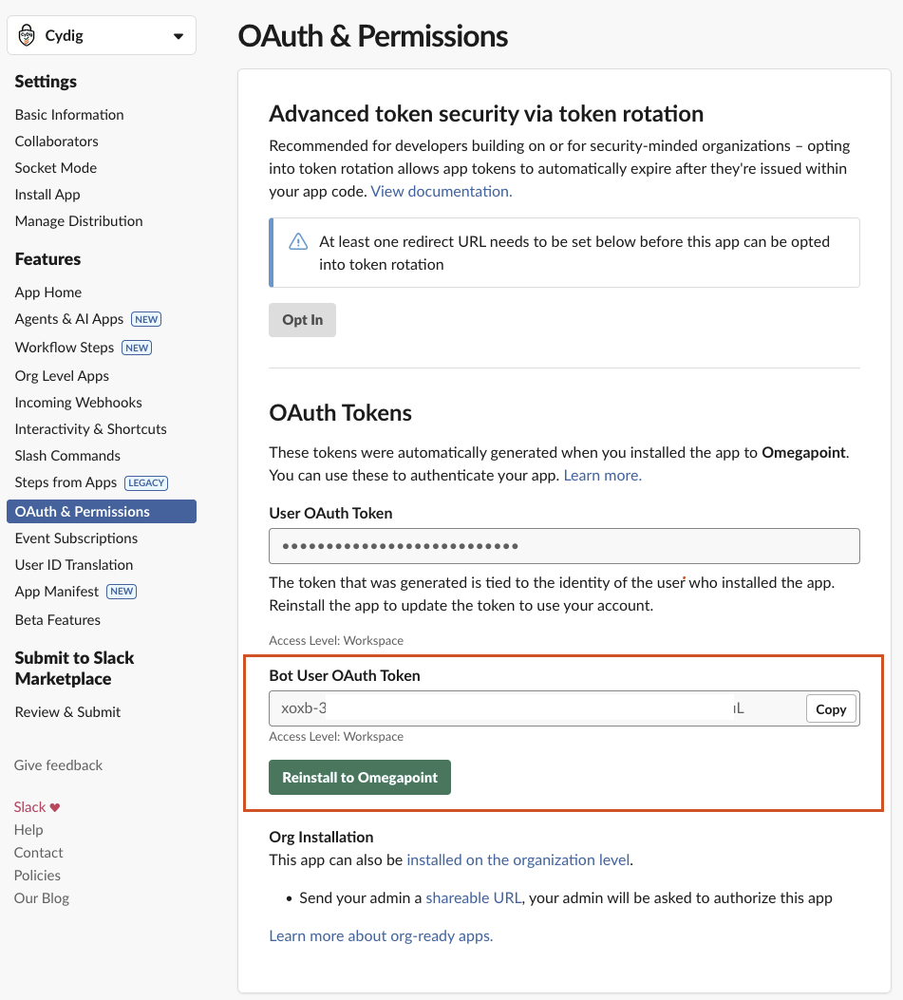
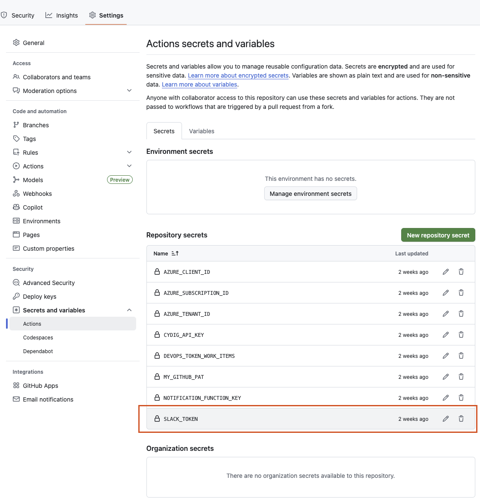

# Introduction

This CyDig project contains a GitHub Action for sending a notification alert to Slack when the Azure compliance score has dropped. The action is designed to run periodically in a workflow, e.g. once every morning, to enable CyDig users to automatically get notified through a Slack Bot and channel when the compliance score has dropped between two days.

The notification action works by fetching the current and previous compliance scores from the compliance-history service (hosted on Azure), comparing these values, and if a drop has been detected, sends a Slack notification to a channel. For example:


# Getting Started

To use the notification action, a Slack Bot and a Function Key to the compliance-history service in Azure must be set up. The function key should be provided by CyDig (please contact CyDig for this), but the Slack Bot must be created and set up using your own desired Slack channel.

## Slack Bot

The Slack Bot needs to be created with read and write permission to the channel where you want to receive your notification. Here is how to create and configure the bot:

1. Create a Slack Bot in your [Slack Apps](https://api.slack.com/apps) with the `chat:write` permission to a channel:  
   
2. Copy the Bot User OAuth Slack token (starts with `xoxb-`)  
   
3. Add the token as a GitHub Secret named **SLACK_TOKEN**. The other variables listed in the picture should be set up but are retrieved from the CyDig team.  
   


## Development on an Existing or New Azure Control

The project is developed using TypeScript and NodeJS. Test are written using Mocha and Chai.

1. To start development, create a branch named **feature/your-branch-name**.

2. Run the command below from the root.

```bash
npm install
```

3. Start developing. To compile your code, run the following command:

```bash
npm run build
```

4. To run the tests, run the following command:
```bash
npm run test
```

To generate test results in an XML file, run the following command:

```bash
npm run testScript
```

5. If necessary, add input parameters in `action.yml` if needed for the control.

6. When pushing the code to the repository, the workflow will build and push your code to the repository.

*For more information about developing in the CyDig project, please go to the [Wiki](https://dev.azure.com/CyDig/CyDig/_wiki/wikis/CyDig.wiki/5/Att-jobba-i-CyDig)*

## Creating a Release for the Action

At CyDig, we follow [Semantic Versioning](https://semver.org/) for our action releases. Practically, this means that when you're developing and creating a pull request (PR), you can assign one of three labels to the PR: Major, Minor, or Patch. These labels correspond to version numbers in the format vX.Y.Z, where X is the major version, Y is the minor version, and Z is the patch version. For example, if you add the "Patch" label to your PR, and it's approved and merged, a workflow will automatically run to create a release for the action. Here's an illustration of how the version number would change before and after the PR:

* Version before PR: v1.0.1
* Version after PR: v1.0.2

